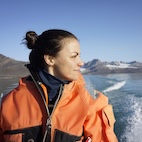
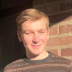
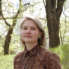

# People

<!-- ## Current members -->

 
 
 

### Mariana P Braga

Loves ecological networks and phylogenies.  
Associate Senior Lecturer, [Department of Ecology](https://www.slu.se/en/departments/ecology/), SLU Uppsala.  
[DDLS](https://www.scilifelab.se/data-driven/) Fellow, SciLifelab

 
 

### Erik Danielsson

Undergrad student at Lund University.  
Working on implementing efficient inference for the host repertoire model in [TreePPL](/docs/projects/TreePPL).

 
 

### Sille Holm

Mother of caterpillars, loves tropical forests.  
Researcher. Field and lab coordinator in the project [SPECTRO](/docs/projects/SPECTRO).